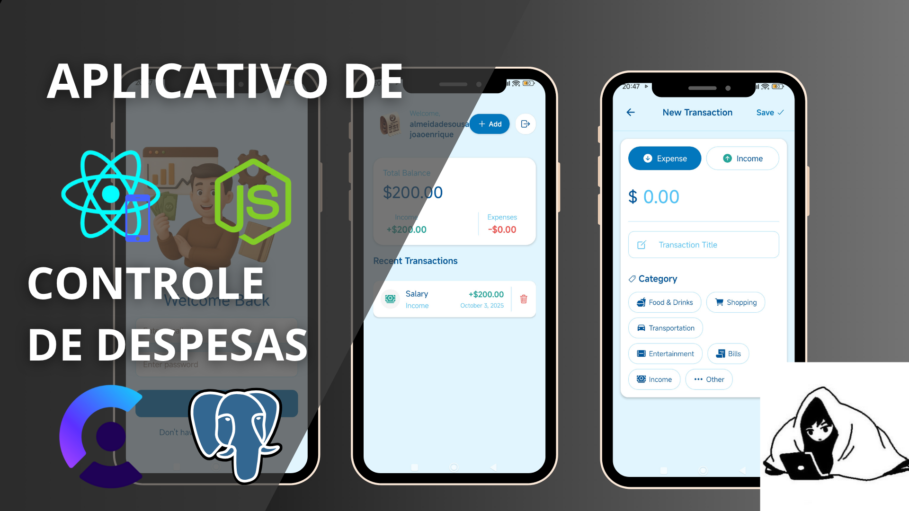

<h1 align="center">💰 App de Controle de Despesas ✨</h1>

<div align="center">
    <a href="https://jedev1.itch.io/controle-de-despesas" target="_blank"> 
         
    </a> 
</div>

<div align="center">
    <a href="https://jedev1.itch.io/controle-de-despesas" target="_blank"> 
         
    </a> 
</div>

<p align="center">
  <b>Um aplicativo mobile para gerenciar suas finanças pessoais de forma prática, seguro e eficiente, construído com as tecnologias mais modernas do ecossistema React Native.</b>
</p>

---

## 🚀 Tecnologias utilizadas

- ⚛️ **React Native** → Aplicativo mobile multiplataforma  
- 🗄 **PostgreSQL** → Banco de dados relacional seguro  
- ⚙️ **Node.js + Express** → Backend robusto e escalável  
- 🔑 **Clerk** → Autenticação de usuários e gerenciamento de sessão  
- 🔐 **Boas práticas** → Tratamento de erros, segurança e organização de código  

<div align="right">
  
  
  
  
  
  
  
</div>

---

## ⚙️ Configuração do ambiente

Crie um arquivo `.env` na raiz do projeto backend com as seguintes variáveis:

```bash
PORT=...
DATABASE_URL=...

UPSTASH_REDIS_REST_URL=...
UPSTASH_REDIS_REST_TOKEN=...
```

E crie um `.env` no raiz do projeto mobile com a seguinte variável:

```bash
EXPO_PUBLIC_CLERK_PUBLISHABLE_KEY=...
```

# ▶️ Como rodar o projeto
### 🔹 Backend (API)
Na pasta do backend:

```bash
cd backend
npm install
npm run dev
```
A API estará disponível em: http://localhost:5001

# 🔹 Frontend (App React Native)
No diretório do app:
```bash
cd mobile
npm install
npx expo start
```
O app pode ser aberto no emulador ou dispositivo físico via Expo Go.

# 📂 Estrutura do projeto
├── backend/         # Código da API (Node.js + Express)</br>
├── mobile/          # Aplicativo React Native </br>
│   ├── components/  # Componentes reutilizáveis</br>
│   ├── screens/     # Telas do app</br>
│   └── styles/      # Estilização e temas</br>
├── preview-for-project.png</br>
├── .env.example     # Exemplo de variáveis de ambiente</br>
└── README.md        <- Você está aqui 😁 </br>

# ✅ Funcionalidades
- 💸 Registrar receitas e despesas
- 📊 Visualizar histórico e relatórios
- 🔐 Login e autenticação segura via Clerk
- 🛠 Gerenciamento de categorias personalizáveis
- 🔍 Sincronização e persistência via PostgreSQL

# 📜 Licença
Este projeto é open-source sob a licença MIT.</br>
Sinta-se à vontade para usar, modificar e contribuir! 🚀

# 🐱‍💻 Autor
Feito com 💙 por João Enrique

<div align="right">
<a href="https://www.linkedin.com/in/joao-enrique-dev/" target="_blank"> 
     
</a> 
<a href="https://www.youtube.com/@joaocodedev" target="_blank"> 
     
</a> 
<a href="https://jedev1.itch.io/" target="_blank"> 
     
</a> 
<a href="https://www.instagram.com/joao__dev/" target="_blank"> 
     
</a> 
<a href="https://www.tiktok.com/@joao__code" target="_blank"> 
     
</a> 
</div>